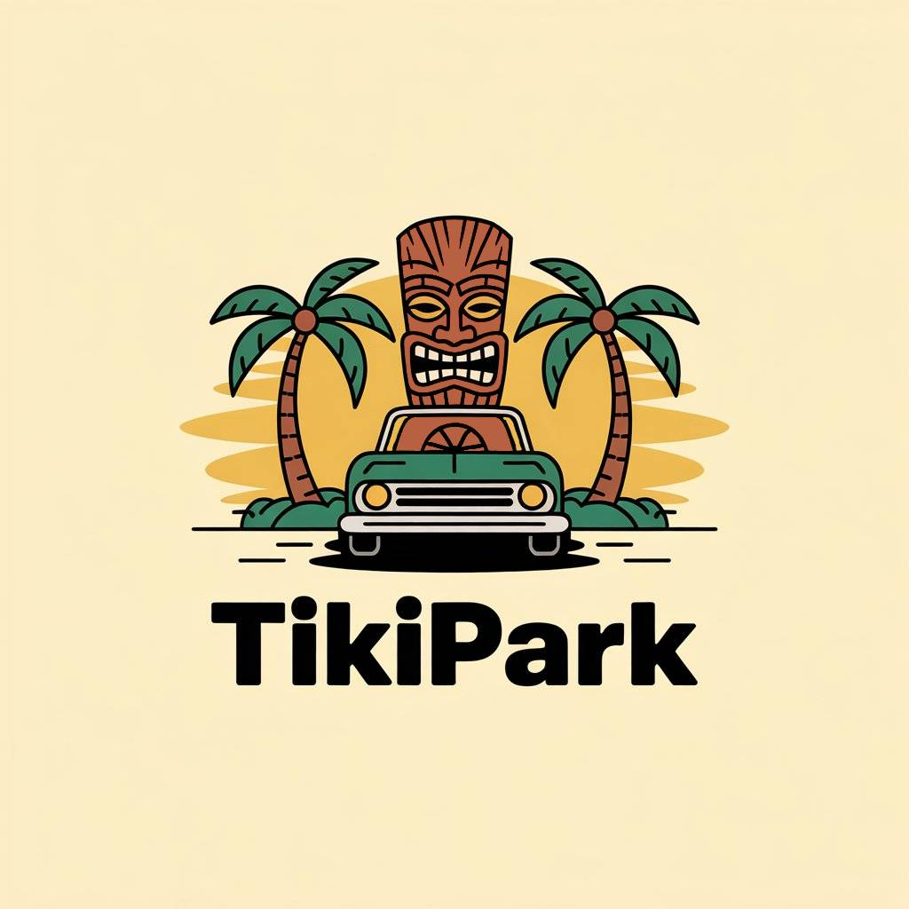

# 🚗 TikiPark – Smart Android Parking App

## 📌 Project Overview

**TikiPark** is a real-time, full-featured **Android parking assistant app** developed in **Java**, designed to simplify finding and reserving urban parking spots. Created as a **collaborative university project**, it combines a modern Android frontend with a robust **PHP/MySQL** backend, **SQLite caching**, and **Google Maps API** for a seamless user experience.

---

## 🚀 Key Features

- 🔐 Secure Login & **Role-Based Authorization** (Admin/User)
- 📍 Interactive **Google Maps API Integration**
- 📊 **Real-Time Parking Availability** via RESTful API
- 📡 **Offline Support** with local **SQLite** caching
- 💳 Wallet-ready architecture for **Payment Integration**
- 🧱 **Modular & Scalable Codebase**

---

## 🧰 Tech Stack

### **Frontend (Android)**

- Java with Android SDK
- XML Layouts
- SQLite (offline storage)
- Google Maps API

### **Backend**

- PHP 8.x
- MySQL

### **DevOps & Tools**

- Git & GitHub
- Android Studio
- Visual Studio Code
- XAMPP (Apache + MySQL)

---

## 📊 Repository Badges

<p align="center">
  
  
  
  
  
</p>

## 🛠️ Installation Guide

### ✅ Step 1: Clone the Repository

```bash
git clone https://github.com/AngelosFikias0/TikiPark.git
cd TikiPark
```

## ✅ Step 2: Android Setup

1. Launch **Android Studio**
2. Select **Open an Existing Project**
3. Navigate to and open the `TikiPark/` directory
4. Click **Run** to build and deploy on an emulator or physical device

---

## ✅ Step 3: Backend Setup (XAMPP)

1. Download & install [XAMPP](https://www.apachefriends.org/)
2. Start **Apache** and **MySQL** from the XAMPP Control Panel
3. Copy the contents of `Backend/` to:

    ```bash
    C:\xampp\htdocs\TikiPark
    ```

4. Open [phpMyAdmin](http://localhost/phpmyadmin/)
5. Create a new database named `TikiPark`
6. Import the schema:

    - File: `Database/tikipark.sql`

7. Update the database credentials in:

    - `Backend/config.php`

---

## 👥 Contribution Guide

### 📌 1. Clone & Set Up Locally

```bash
git clone https://github.com/AngelosFikias0/TikiPark.git
cd TikiPark
git checkout main
git fetch origin
git pull origin main
```

---

### 📌 2. Create a New Feature Branch

```bash
git checkout -b feature-branch-name
```

---

### 📌 3. Sync Before Coding

```bash
git fetch origin
git pull origin main
```

---

### 📌 4. Commit & Push Your Changes

```bash
git add .
git commit -m "✅ Add: New feature implementation"
git push origin feature-branch-name
```

---

### 📌 5. Submit Pull Request

1. Go to the GitHub Repository: [https://github.com/AngelosFikias0/TikiPark](https://github.com/AngelosFikias0/TikiPark)
2. Click **New Pull Request**
3. Compare `feature-branch-name` with `main`
4. Add a description and click **Create Pull Request**

---

### 📌 6. Sync After Merge

```bash
git checkout main
git pull origin main
```

---

### 📌 7. (Optional) Delete Feature Branch

```bash
git branch -d feature-branch-name
git push origin --delete feature-branch-name
```

---

## 💡 Get Involved

Built with teamwork, clean architecture, and real-world tools, **TikiPark** is open to feedback, ideas, and contributors. Perfect for students, hobbyists, or professionals who want to sharpen mobile development skills.

📬 **Questions? Bugs? Suggestions?**

- [Open an Issue](https://github.com/AngelosFikias0/TikiPark/issues)
- [Message on LinkedIn](https://www.linkedin.com/in/angelosfikias)


---

## 📄 Documentation

➡️ [Documentation](Documentation.docx)

---

## 📈 Analysis

➡️ Coming soon...

---

## 📺 YouTube Video

➡️ Coming soon...

---

## 📸 Screenshots

➡️ Coming soon...

---


